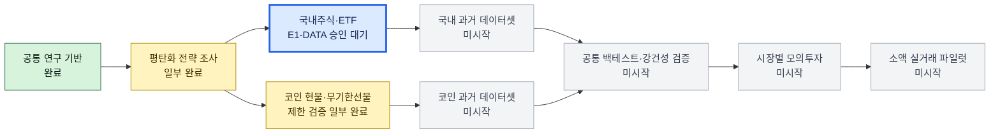

# autotrade-lab

A multi-asset laboratory for researching systematic strategies across Korean-listed stocks,
ETFs, and crypto markets. The project separates research, simulation, paper trading, risk,
and live execution so a promising backtest cannot accidentally become a real order.

> This is research software, not investment advice. No strategy is assumed profitable.
> Live trading is disabled by default.

## 프로젝트 진행 상황

**현재 위치:** 공통 연구 기반 위에서 국내주식/ETF와 코인을 병렬로 검증하고 있습니다.
국내 트랙은 Gate E1-PREP을 완료하고 공식 일봉 데이터의 제한 검증 승인을 기다립니다.
코인 트랙은 Gate C의 제한적 캔들 수집을 완료했지만 생애주기·이용권·펀딩·거래비용
검증이 남았습니다. 어느 트랙도 본격 백테스트, 모의투자, 실거래를 시작하지 않았습니다.



[전체 마일스톤 대시보드](docs/ROADMAP.html)에서 완료 근거, 중단 게이트, 앞으로 남은 단계를
확인할 수 있습니다. 정확한 현재 작업은 [활성 핸드오프](research/runs/HANDOFF.md)를 기준으로
판단합니다.

## Current scope

- 35 strategy hypotheses catalogued across 13 families
- 9 executable single-instrument and 5 portfolio/pairs/carry baseline strategies
- A look-ahead-safe vector backtester with fees, slippage, turnover, drawdown, and Sharpe
- Common broker boundary for Toss Securities and Binance/Upbit-compatible transports
- Fail-closed live-trading guard and portfolio-level risk checks
- KRX equities/ETFs through Toss Securities and crypto spot/perpetual instrument models

Before historical data is collected, every idea is treated as an equal `hypothesis` regardless
of whether it came from a journal, a trader, a community post, source code, or a video. Source
type is provenance metadata, not a quality score. Catalog status describes implementation
progress only; promotion happens later through the same data and execution-aware tests.

## Quick start

```bash
python -m venv .venv
source .venv/bin/activate
pip install -e '.[dev]'
pytest
```

```python
import pandas as pd
from autotrade_lab.engine import VectorBacktester
from autotrade_lab.strategies import DonchianBreakout

bars = pd.read_csv("ohlcv.csv", index_col=0, parse_dates=True)
result = VectorBacktester(fee_bps=5, slippage_bps=10).run(bars, DonchianBreakout())
print(result.metrics)
```

## Repository map

```text
src/autotrade_lab/
  brokers/       broker-neutral interfaces and guarded adapters
  catalog.py     full hypothesis registry
  engine.py      reproducible baseline backtester
  models.py      instruments and orders
  risk.py        pre-trade portfolio limits
  strategies.py executable signal baselines
docs/
  AGENT_WORKFLOW.md
  DISCOVERY_PR_WORKFLOW.md
  RESEARCH_CATALOG.md
  RESEARCH_PROTOCOL.md
  SOURCES.md
research/runs/
  HANDOFF.md    active objective and cross-device resume state
tests/
```

## Non-negotiable validation rules

- Signals execute one bar later; future data must never enter features.
- Use point-in-time KRX constituents and fundamentals, adjusted prices, delisted assets,
  exchange calendars, taxes, and realistic fills.
- For perpetuals include funding, mark price, liquidation, collateral, and venue failure.
- Report failed variants and apply walk-forward, holdout, and multiple-testing controls.
- Paper trade before real capital. Live adapters require two explicit environment settings;
  broker credentials belong only in local environment variables or a secret manager.

Agents and contributors should start with [AGENTS.md](AGENTS.md) and the
[active handoff](research/runs/HANDOFF.md). See [the research protocol](docs/RESEARCH_PROTOCOL.md),
[agent workflow](docs/AGENT_WORKFLOW.md), and [strategy catalog](docs/RESEARCH_CATALOG.md) for the
roadmap and operating constraints.
